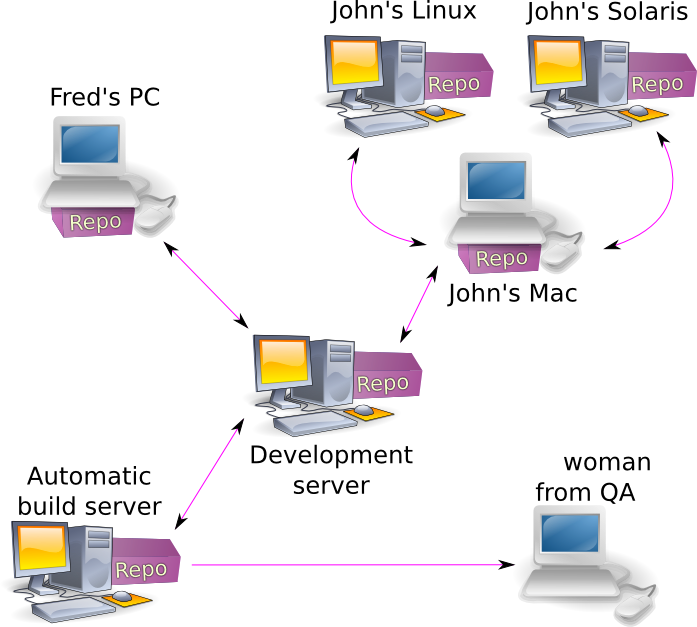

!SLIDE center
## What is Git?

!SLIDE subsection center
## Open Source

.notes Git is open source freely available application which tracks files

!SLIDE subsection center
## Distributed

.notes Git tracks files in a distributed mannor.

!SLIDE subsection center
## Distributed

.notes allowing for files to be shared and collaborated on in a more effective manor.

!SLIDE subsection center
## Secure

.notes The data tracked by a Git repository is able to be transferred over secure protocols such ass SSH and HTTPS

